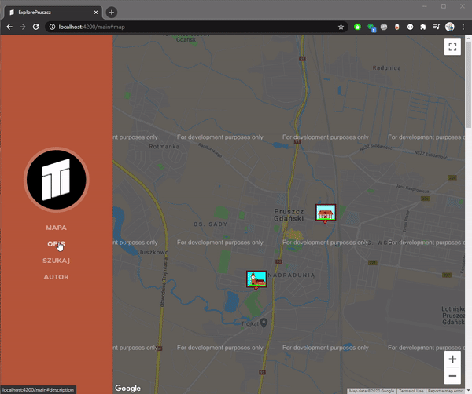
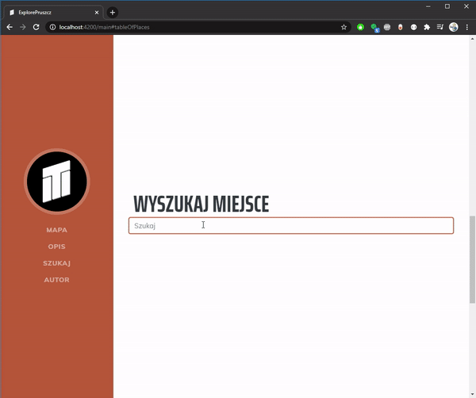
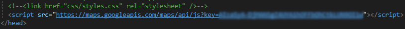
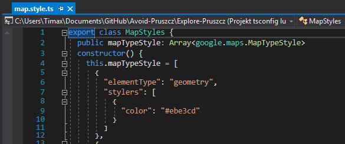
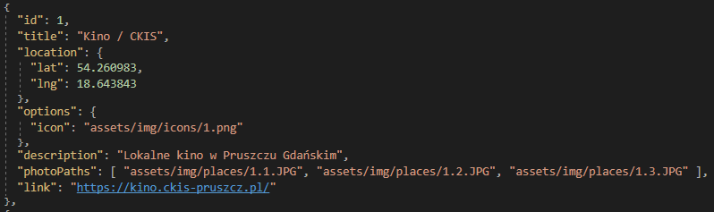

# 𝗘𝘅𝗽𝗹𝗼𝗿𝗲 𝗣𝗿𝘂𝘀𝘇𝗰𝘇
Explore Pruszcz is map based web app created in Angular Framework. It's goal is to promote city Pruszcz Gdański.

## 𝗧𝗮𝗯𝗹𝗲 𝗼𝗳 𝗖𝗼𝗻𝘁𝗲𝗻𝘁𝘀
* [About project](#about-project)
* [Functionality](#functionality)
* [Additional info.](#additional-info)
  * [Api key](#api-key)
  * [Map styles](#map-styles)
  * [Data and pictures](#data-and-pictures)
* [Author](#author)

## About project
This project started as me testing google maps module in Angular, but then it was supposed to became project for the competition about city promotion (maybe it will).
If you want to learn more about maps module in Angular I highly recommend [this](https://medium.com/angular-in-depth/google-maps-is-now-an-angular-component-821ec61d2a0) article.

Note: In my project i used bootstrap template ,,Resume" which is published on [startbootstrap.com](https://startbootstrap.com/themes/resume/) under [MIT](https://github.com/StartBootstrap/startbootstrap-resume/blob/master/LICENSE) licence.
## Functionality


It's safe to say, app functionality is basic. User can find place by navigating on map or by using search bar to get photos and information about places.
## Additional Info
Here's some additional info. that I thought might be usefull
### Api key
The api key is located in ```index.html``` file. If you want to use your own api key, just replace mine.

### Map styles
You can use custom map styles that you can create [here](https://mapstyle.withgoogle.com/). Just replace the current style in ```map.style.ts``` file.

### Data and pictures
All data about places is stored in loacal Json file named ```appData.json```. You can edit this file to add, remove or modify places.


All photos and icons are located in ```asserts\img``` broken down to separate folders.

## Author
Mateusz Kusiak
